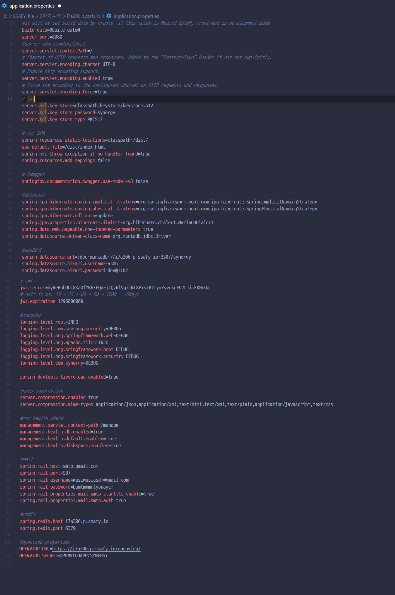
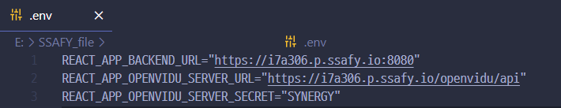

## 1. Docker, Docker Compose 설치

```bash
sudo apt-get update

sudo apt-get install \
	apt-transport-https \
	ca-certificates \
	curl \
	gnupg \
	lsb-release

sudo -fsSL https://download.docker.com/linux/ubuntu/gpg | sudo gpg --dearmor -o
/usr/share/keyrings/docker-archive-keyring.gpg

echo \
	"deb [arch=amd64 signed-by=/usr/share/keyrings/docker-archive-keyring.gpg]
	https://download.docker.com/linux/ubuntu \
	$(lsb_release -cs) stable" | sudo tee /etc/apt/sources.list.d/docker.list > /dev/null

sudo apt-get update

sudo apt-get install docker-ce docker-ce-cli containerd.io

sudo curl -L "https://github.com/docker/compose/releases/download/1.29.2/docker-compose-$(uname -s)-$(uname -m)" -o /usr/local/bin/docker-compose

sudo chmod +x /usr/local/bin/docker-compose
```

## 2. MariaDB

mariaDB 이미지를 도커허브에서 받아 구동시킨다.

```bash
docker pull mariadb:10.6
#mariadb 컨테이너 구동
docker run --name mariadb -d -p 3307:3306 -e MYSQL_ROOT_PASSWORD=root mariadb
```

mariadb에 접속

```bash
docker exec -it mariadb /bin/bash
mysql -u root -p
```

my.cnf 수정

```bash
apt-get update
apt-get install vim
vi /etc/mysql/my.cnf
```

```
character-set-client-handshake = FALSE
init_connect="SET collation_connection = utf8_general_ci"
init_connect="SET NAMES utf8"
character-set-server = utf8

[client]
default-character-set = utf8

[mysql]

default-character-set = utf8

[mysqldump]
default-character-set = utf8
```

컨테이너 재시작

```
docker stop mariadb
docker start mariadb
```

MaridDB 유저 추가

1. mariadb 컨테이너에 접속

```bash
docker exec -it mariadb /bin/bash
mysql -u root -p
```

2. 사용자추가

```sql
create user ‘userID’@’%’ identified by ‘userpassword’;
flush privileges;
```

3. 데이터베이스 생성

```sql
create database DBname;
```

4. 권한 확인 및 부여

```sql
show grants for userID@'%';
grant select, insert, upsdate on DBname.* to 'userID'@'%';
```

## 3. Redis

별도 설정 없이 docker hub에서 redis 설치

```bash
docker run redis
```

## 4. Nginx, TLS 설정

Nginx 설치

```bash
sudo apt-get install nginx
```

certbot

```bash
sudo apt-get update #apt-get 업데이트
sudo apt-get install software-properties-common #선행 소프트웨어 설치
sudo add-apt-repository ppa:certbot/certbot #저장소 추가
sudo apt-get update #apt-get 업데이트
sudo apt-get install certbot #certbot 설치

certbot certonly --nginx -d {도메인주소}
#이후 나오는 내용과 이메일입력등을 진행하면 된다.
```

인증서는 `/etc/letsencrypt/live` 아래에 생성된다.

ningx default.conf 파일 설정

```bash
sudo vi /etc/nginx/sites-available/default

server {
	listen 80 default_server;
	listen [::]:80 default_server;
  server_name i7a306.p.ssafy.io; # managed by Certbot

	# react 프록시
  location / {
          proxy_pass http://127.0.0.1:3000/;
  }

  # openvidu 프록시 설정
  location /openvidu/api {
          proxy_pass http://127.0.0.1:5443/openvidu/api;
  }

	listen [::]:443 ssl ipv6only=on; # managed by Certbot
	listen 443 ssl; # managed by Certbot
	ssl_certificate /etc/letsencrypt/live/i7a306.p.ssafy.io-0001/fullchain.pem; # managed by Certbot
	ssl_certificate_key /etc/letsencrypt/live/i7a306.p.ssafy.io-0001/privkey.pem; # managed by Certbot
	include /etc/letsencrypt/options-ssl-nginx.conf; # managed by Certbot
	ssl_dhparam /etc/letsencrypt/ssl-dhparams.pem; # managed by Certbot

}

server {
    if ($host = i7a306.p.ssafy.io) {
        return 301 https://$host$request_uri;
    } # managed by Certbot

    listen 80 ;
    listen [::]:80 ;
    server_name i7a306.p.ssafy.io;
    return 404; # managed by Certbo
}
```

nginx reload

```bash
nginx -s reload
```

[https://도메인](https://도메인) 으로 접속해 사이즈 주소창 왼쪽의 자물쇠 확인

## 5. **Openvidu 배포**

openvidu에서 사용하는 포트

- `22 TCP`, `80 TCP`, `443 TCP`, `3478 TCP+UDP`, `40000~57000 TCP+UDP`, `57001~65535 TCP+UDP`

```bash
#root 권한
sudo su
# openvidu는 /opt 디렉토리에 설치하는 것을 권장
cd /opt

#Openvidu 설치 openvidu On premise 참조
curl <https://s3-eu-west-1.amazonaws.com/aws.openvidu.io/install_openvidu_latest.sh> | bash
cd openvidu

#openvidu설정
vi .env
```

```bash
# OpenVidu configuration
# ----------------------
# 도메인 또는 퍼블릭IP 주소
DOMAIN_OR_PUBLIC_IP=i7a306.p.ssafy.io
# 오픈비두 서버와 통신을 위한 암호 임의의 값을 지정
OPENVIDU_SECRET=SYNERGY
# Certificate type
CERTIFICATE_TYPE=letsencrypt
# 인증서 타입이 letsencrypt일 경우 이메일 설정
LETSENCRYPT_EMAIL=user@example.com

# HTTP_PORT와 HTTPS_PORT는 letsencrypt 방식의 키를 발급 받기 전까진 기본 포트인 80, 443을 사용해야 한다.
# 키를 발급받고 난 후에 포트를 변경하자
# HTTP port
HTTP_PORT=8081
# HTTPS port(해당 포트를 통해 오픈비두 서버와 연결)
HTTPS_PORT=8443
```

openvidu server 실행

```bash
./openvidu start
# 정상 작동을 확인하고 ctrl + C를 눌러 나옴
```

https://<DOMAIN_OR_PUBLIC_IP>:<HTTPS_PORT> 접속해 정상 동작 확인

## 6. Jenkins

[Jenkins 설정 방법](./Jenkins.md)

## 7. 백엔드 배포

### Spring Boot

1. ssl 인증서 등록

```bash
#EC2 서버에서 작업
sudo su
cd /etc/letsencrypt/live/도메인/

openssl pkcs12 -export -in fullchain.pem -inkey privkey.pem -out keystore.p12 -CAfile chain.pem -caname root
```

변환한 인증서를 백엔드 프로젝트의 resources/keystore에 복사

`cp keystore.p12 home/ubuntu/S07P12A306/synergy/src/main/resources/keystore/keystore.p12`

인증서 관련 정보를 application.properties에 설정

```bash
#ssl
server.ssl.key-store=classpath:keystore/keystore.p12
server.ssl.key-store-password={p12인증서 발급시 입력했던 비밀번호}
server.ssl.key-store-type=PKCS12
```

2. application.properties의 DB 유저, 비밀번호, 도메인 변경
3. 프로젝트 최상단에서 gradlew build 실행
   1. Windows : `.\gradlew build`
4. build/libs에 jar 파일 생성 확인
5. Dockerfile 작성

```jsx
# Start with a base image containing Java runtime
FROM openjdk:11

# Add Author info
LABEL maintainer="name@gmail.com"

# Add a volume to /tmp
VOLUME /tmp

# Make port 8080 available to the world outside this container
EXPOSE 8080

# The application's jar file
ARG JAR_FILE=build/libs/synergy-web-project-1.0-SNAPSHOT.jar

# Add the application's jar to the container
ADD ${JAR_FILE} a306.jar

# Run the jar file
ENTRYPOINT ["java","-jar","/a306.jar"]
```

1. 도커로그인
   `docker login`
2. 도커이미지 빌드
   `docker build -t {배포 담당자 도커 계정}/{도커 이미지 이름}:{버전} .`
3. 도커 이미지 업로드
   `docker push {배포 담당자 도커 계정}/springboot:latest`
4. 도커 실행
   `docker run -d -p 5000:8080 springboot`
   포트포워드 , 타임존, 실행 백그라운드 옵션 지정해서 실행

Ref

- [https://imasoftwareengineer.tistory.com/40](https://imasoftwareengineer.tistory.com/40)

## 8. 프론트엔드 배포

### React

프론트 프로젝트 최상단에 Dockerfile 추가

```bash
FROM node:latest as builder

# 작업 폴더를 만들고 npm 설치
RUN mkdir /usr/src/app
WORKDIR /usr/src/app
ENV PATH /usr/src/app/node_modules/.bin:$PATH
COPY package.json /usr/src/app/package.json
RUN npm install --silent
#RUN npm install react-scripts@3.4.1 -g --silent

# 소스를 작업폴더로 복사하고 빌드
COPY . /usr/src/app
RUN npm run build

FROM nginx:latest
# nginx의 기본 설정을 삭제하고 앱에서 설정한 파일을 복사
RUN rm -rf /etc/nginx/conf.d
COPY conf /etc/nginx

# 위에서 생성한 앱의 빌드산출물을 nginx의 샘플 앱이 사용하던 폴더로 이동
COPY --from=builder /usr/src/app/build /usr/share/nginx/html

# 80포트 오픈하고 nginx 실행
EXPOSE 80
CMD ["nginx", "-g", "daemon off;"]
```

conf/conf.d/default.conf
api 관련 설정 들어가 있음

1. 도커로그인
   `docker login`
2. 도커이미지 빌드
   `docker build -t {배포 담당자 도커 계정}/{도커 이미지 이름}:{버전} .`
3. 도커 이미지 업로드
   `docker push {배포 담당자 도커 계정}/react:latest`
4. 도커 실행
   `docker run -d -p 3000:80 react`
   포트포워드 , 타임존, 실행 백그라운드 옵션 지정해서 실행

---

## etc

### 사용버전과 포트번호

OS : `Ubuntu 20.04 LTS (GNU/Linux 4.15.0-72-generic x86_64)`

IDE

- Intellij Ultimate `2022.1`
- vscode

jdk : `openjdk version "11" 2018-09-25`

node : `16.15.1`

MariaDB : `10.6`

Docker version `20.10.17, build 100c701`

```
FrontEnd: 443(3000)
BackEnd: 8080
Openvidu: 5443
Kurento-Media-Server: 8888
MariaDB: 3307
Redis: 6379
Jenkins: 8085
```

### 환경변수

- applications.properties

  

- .env

  

### 구글 gmail smtp

1. 구글 계정 로그인, 계정설정 > 보안
2. 2단계 인증 설정 후 앱 비밀번호 생성
3. 백엔드 프로젝트의 application.properties에 앱 비밀번호 등록

```bash
spring.mail.host=smtp.gmail.com
spring.mail.port=587
spring.mail.username= ~~~@gmail.com // gmail 계정
spring.mail.password=qcyuiqxjmjtgosqh // 앱 비밀번호
spring.mail.properties.mail.smtp.auth=true
spring.mail.properties.mail.smtp.timeout=5000
spring.mail.properties.mail.smtp.starttls.enable=true
```

### DB 덤프
